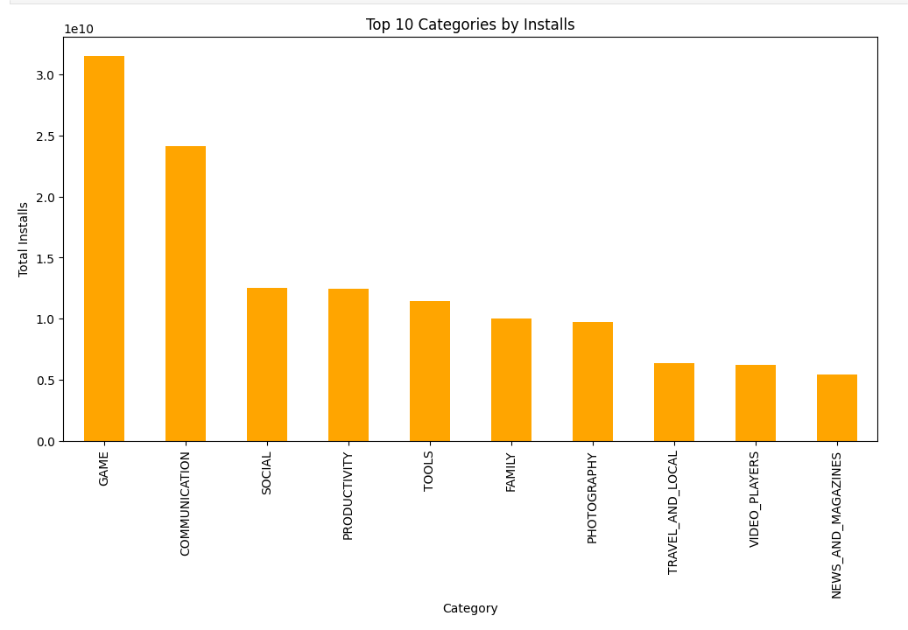
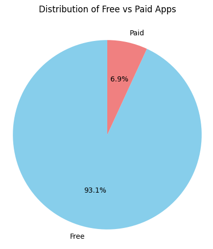
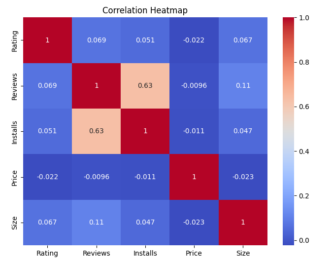

# Google-Play-Store-Analysis


# Google-Play-Store-Analysis

This project analyzes the Google Play Store dataset to uncover trends in app categories, ratings, installs, pricing, and user sentiment. Using Python (Pandas, Matplotlib, Seaborn), the analysis provides key insights and business recommendations for app developers and businesses to succeed in the competitive mobile app market.

---

### 🎯 Objectives

- To explore and analyze the Google Play Store dataset for patterns and trends in apps.  
- To identify the most popular **categories** and **genres** based on app count and installs.  
- To study the distribution of **ratings**, **reviews**, and **sentiments** to evaluate user satisfaction.  
- To compare **free vs paid apps** in terms of availability, pricing, and performance.  
- To understand how **app size, updates, and pricing** impact user ratings and installs.  
- To generate meaningful **business insights and recommendations** for developers and organizations aiming to succeed in the mobile app market.  


---

### 🔑 Key Insights

- The Play Store is dominated by **FAMILY, GAME, and TOOLS** categories, while smaller categories (e.g., EVENTS, BEAUTY) present niche opportunities.  
- **Free apps form the majority**, highlighting the importance of ad-based and in-app purchase monetization models.  
- **Paid apps are mostly priced between $1–$5**, showing that users are highly price-sensitive.  
- **Games, Communication, and Social apps** drive the highest installs, indicating strong user demand in these areas.  
- **App ratings are generally high (4.0–4.5)**, but some popular apps with millions of installs still struggle with low ratings.  
- **Lightweight apps (<50 MB)** tend to be more successful, especially in regions with limited storage and bandwidth.  
- **Regularly updated apps** receive better ratings, showing the importance of maintenance and improvements.  
- **User sentiment is largely positive**, but negative reviews provide valuable feedback for app improvements.  
- **Reviews and installs are strongly correlated**, while rating is independent of size, price, or installs.  

**Overall:** Apps that are **free, lightweight, regularly updated, and user-focused** perform best in the Play Store, while strategic opportunities exist in both popular and niche categories.  


---

### 💡 Recommendations

- **Adopt a Freemium Model:** Since most apps are free, developers should focus on monetization through ads, in-app purchases, or premium upgrades rather than upfront payments.  
- **Keep Apps Lightweight:** Optimize app size (<50 MB) to improve installs, especially in bandwidth-limited markets.  
- **Focus on Popular Categories:** Target high-demand areas like **Games, Communication, and Social**, while exploring niche categories (Events, Beauty) for less competition.  
- **Prioritize Regular Updates:** Frequent updates improve ratings and user retention by fixing bugs and adding new features.  
- **Enhance User Experience:** Actively address negative reviews and feedback to increase user satisfaction and maintain high ratings.  
- **Price Smartly:** Keep paid apps within the **$1–$5 range** to attract more users while balancing revenue.  
- **Leverage Sentiment Analysis:** Use review sentiment insights to identify pain points and improve app performance.  

**Overall:** A strategy that combines **freemium pricing, lightweight design, frequent updates, and user-driven improvements** will maximize success on the Play Store.  


---

### 🛠 Tech Stack

- **Programming Language:** Python  
- **Data Handling & Analysis:** Pandas, NumPy  
- **Data Visualization:** Matplotlib, Seaborn  
- **Exploratory Data Analysis (EDA):** Statistical insights, correlation analysis  
- **Tools & Environment:** Jupyter Notebook
- **Dataset:** Google Play Store Apps Dataset  


---

## 📂 Project Structure

```
├── data/                  # Raw & cleaned datasets
├── notebooks/             # Jupyter notebooks
├── images/                # Visualizations exported from notebooks
├── README.md              # Project overview (this file)
```

---

## ⚙️ How to Run

1. Clone this repository

   ```bash
  git clone https://github.com/Kaif-pathan1117/google-play-store-analysis.git
cd google-play-store-analysis

   ```
2. Launch Jupyter Notebook

   ```bash
   jupyter notebook
   ```

3. Open `Google_Play_Store_Apps_Analysis.ipynb` and run the cells step by step.

---

## 📊 Results

Here are some key visualizations from the analysis:

## 📊 Results

Here are some key visualizations from the analysis:

### Top 10 Categories by Installs


### Distribution of Free vs Paid Apps


### Correlation Heatmap



---

## 🙌 Acknowledgments

* [Kaggle](https://www.kaggle.com/lava18/google-play-store-apps) for providing the **Google Play Store Apps Dataset**.  
* Open-source Python libraries **Pandas, NumPy, Matplotlib, Seaborn** for enabling efficient data analysis and visualization.  
* The developer and data science community for valuable resources, discussions, and inspiration in exploring app market insights.  


---

### 🚀 Future Work

* **Time-Series Analysis:** Track how app ratings, reviews, and installs change over time to identify trends and seasonal patterns.  
* **Predictive Modeling:** Build machine learning models to **predict app success**, rating, or likelihood of high installs based on features like category, price, size, and content rating.  
* **Sentiment Analysis Expansion:** Apply more advanced NLP techniques on user reviews to gain **deeper insights into user satisfaction and pain points**.  
* **Revenue & Monetization Study:** Explore how in-app purchases, ads, and pricing strategies affect app popularity and profitability.  
* **Comparative Analysis:** Compare Google Play Store data with **Apple App Store** to identify differences in user behavior, category trends, and monetization.  
* **Interactive Dashboard:** Create a **Power BI or Plotly Dash dashboard** for real-time filtering, exploration, and visualization of app data.  


---

✅ **Final Note:**  
This project highlights the intersection of **data, business strategy, and user behavior** in the mobile app ecosystem.  
The Google Play Store serves as a dynamic case study of how app category, pricing, ratings, and user engagement influence popularity and market success.

